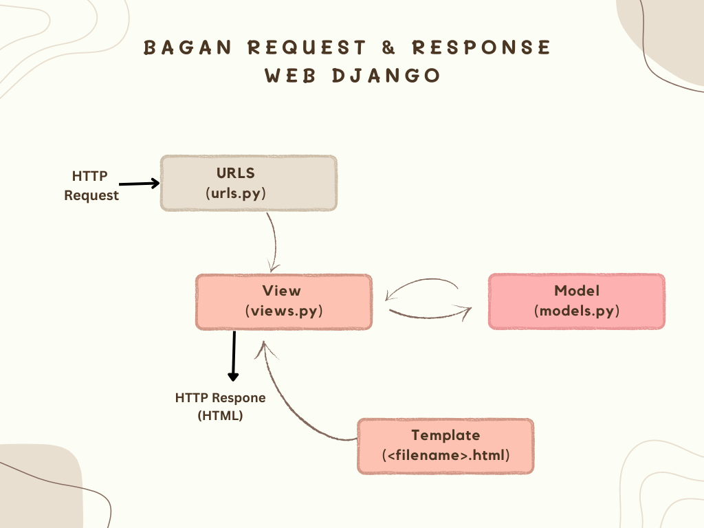

# Penjelasan Checklist
link: https://tugas02.adaptable.app/main

#### Membuat sebuah projek django baru
* Sebelum membuat projek Django, saya membuat repositori terlebih dahulu. Saya sudah punya akun github, maka dari itu, saya langsung membuat repositori di situs github dengan nama tugas2 dan mengatur visibilitas proyek menjadi "Public".
* Setelah itu, saya membuat direktori lokal dan menginisiasinya dengan mengetik `git init` di command prompter.
* Selanjutnya, repositori direktori lokal perlu dihubungkan dengan repositori di Github. Maka dari itu, saya menjalankan terminal atau command prompt di direktori kemudian menjalankan perintah `git branch -M main` di mana saya membuat branch utama baru dengan nama "main". Untuk menghubungkan dengan repositori di Github, saya meng-copy URL repositori saya lalu menjalankan perintah `git remote add origin https://github.com/EllishaNatasha/tugas2.git`. Perintah ini bertujuan untuk memberitahu Git agar menambahkan remote repository dengan nama "origin" ke repositori lokal.
* Selanjutnya, saya membuat virtual environment dengan menjalankan perintah `python -m venv env`. Perintah ini berfungsi untuk menghindari 'tabrakan' antara package dan dependencies dari aplikasi yang baru dibuat dengan versi lain aplikasi yang ada di komputer. Untuk mengaktifkannya, saya menjalankan perintah `env\Scripts\activate.bat`
* Lalu, saya membuat berkas requirements.txt dan menambahkan dependencies. Dependencies tersebut perlu dipasang dengan perintah `pip install -r requirements.txt` 
* Setelah melakukan proses-proses di atas, barulah saya membuat projek Django dengan menjalankan perintah "django-admin startproject tugas2"
* Kemudian, saya menambahkan berkas .gitignore agar ketika push ke github, file-file yang dipush hanya file-file yang diperlukan. 

#### Membuat aplikasi dengan nama main

* Saya menjalankan perintah `python manage.py startapp main` pada command prompt untuk membuat aplikasi baru
* Selanjutnya, aplikasi tersebut perlu didaftarkan pada proyek sehingga saya memodifikasi suatu kode yang ada di berkas settings.py terutama di variabel INSTALLED_APPS. Saya menambahkan 'main' ke dalam variabel tersebut untuk mendaftarkan aplikasi yang sudah diinstal.

#### Melakukan routing pada proyek
* Untuk menghubungkan rute URL dengan tampilan, perlu dilakukan langkah-langkah berikut
* Pertama, buka berkas urls.py dalam direktori proyek dan kemudian mengimport include dari django.urls untuk mengatur URL-URL yang terkait dengan setiap aplikasi
* Kemudian, tambahkan rute URL berikut untuk mengarahkan tampilan main dalam variabel urlpatterns
    ```
    urlpatterns = [
        ...
        path('main/', include('main.urls')),
        ...
    ]
    ```
    Path URL 'main/' akan menuju ke rute yang telah didefinisikan di berkas urls.py aplikasi main

#### Membuat model pada aplikasi main 
* Pertama, buka berkas models.py pada direktori aplikasi main kemudian isi berkas tersebut dengan kode sebagai berikut:
    ```
    from django.db import models

    class Product(models.Model):
        name = models.CharField(max_length=255)
        amount = models.IntegerField()
        description = models.TextField()
    ```
    Atribut yang digunakan adalah name, amount, dan description. Name merupakan nama item dengan tipe CharField. Amount merupakan jumlah item dengan tipe IntegerField. Sedangkan description merupakan deskripsi item dengan tipe TextField.
    
#### Membuat sebuah fungsi pada views.py
* Saya membuat direktori baru bernama templates di dalam direktori aplikasi main yang di dalamnya saya buat berkas baru bernama main.html
* Berkas main.html ini akan mengatur tampilan pada web, maka perlu diisi sebagai berikut:
    ```
    <h1>Tugas 2</h1>

    <p>Name: Ellisha Natasha</p> 
    <p>Class: PBP D</p> 
    <p>Description: Glasses</p>
    <p>Amount : 50</p>
    ```
* Setelah itu, view harus dihubungkan dengan template agar tampilan web dapat menampilkan data dari model. Pertama, saya menambahkan baris kode `from django.shortcuts import render` pada berkas views.py untuk mengimpor fungsi render dari modul django.shortcuts. Render akan digunakan untuk merender tampilan HTML.
* Kemudian, saya menambahkan fungsi show_main dengan kode sebagai berikut
    ```
    def show_main(request):
        context = {
            'name': 'Ellisha Natasha',
            'class': 'PBP D',
            'description': 'Glasses',
            'amount': '50',
        }

        return render(request, "main.html", context)
    ```
    Fungsi ini untuk mengolah permintaan dan memberikan hasil tampilan yang sesuai. Kode ini memiliki context yang berupa dictionary berisi data-data yang akan ditampilkan.
* Untuk menampilkan data yang diambil dari model, saya mengubah template main.html menjadi:
    ```
    <p>Name: {{ name }}</p> 
    <p>Class: {{ class }}</p> 
    <p>Description: {{ description }}</p>
    <p>Amount : {{ amount }}</p>
    ```
    {{ name }} dan {{ class }} berisi nilai dari variabel yang sudah dibuat pada context.
    
#### Membuat sebuah routing pada urls.py aplikasi main
* Pertama, saya membuat berkas urls.py pada direktori main. Mengapa berkas ini perlu dibuat? Hal ini karena berkas ini berfungsi untuk mengarahkan request dari user ke tampilan yang tepat. Berkas ini digunakan untuk menentukan rute URL yang terkait. 
* Kemudian, berkas urls.py yang sudah dibuat diisi dengan kode berikut. 
    ```
    from django.urls import path
    from main.views import show_main

    app_name = 'main'

    urlpatterns = [
        path('', show_main, name='show_main'),
    ]
    ```
    Penjelasan dari kode di atas, yaitu:
    - app_name = 'main' berguna untuk memberikan namespace pada grup URL untuk menghindari konflik nama URL pada aplikasi dalam proyek yang mungkin memiliki URL yang sama
    - urlpatterns merupakan list objek path yang mendefinisikan pola URL, tampilan, dan nama URL. 
    - path('', show_main, name='show_main' adalah pola URL. Pola "" artinya akan cocok dengan URL root dan ketika cocok, tampilan show_main akan dipanggil.

#### Melakukan deployment ke Adaptable
* Login ke situs adaptable lalu buat aplikasi baru dan pilih connect an existing repository.
* Kemudian, pilih all repositories pada saat proses instalasi
* Pilih repo dan branch sesuai proyek
* Pilih Python App Template
* Pilih PostgreSQL
* Saya pilih python veri 3.10  lalu masukkan perintah `python manage.py migrate && gunicorn tugas2.wsgi.` pada start command
* Kemudian, saya memasukkan nama aplikasi yaitu tugas02
* Centang bagian HTTP Listener on Port dan mulai mendeploy aplikasi


---

# Bagan Request Client Beserta Responnya


##### Penjelasan kaitan antara urls.py, views.py, dan berkas html:
- HTTP request merupakan request dari client pada web browser.
- Urls.py berfungsi untuk melakukan routing dan mencari url yang sesuai untuk ditampilkan
- views.py menggunakan data yang didapat dari models.py untuk memroses request
- Jika data sudah selesai diproses dan diolah, data akan ditampilkan oleh view menggunakan tampilan dari template yang berupa berkas html
- Kemudian, hasilnya akan ditampilkan sebagai HTTP response kepada pengguna dan ditampilkan pada web user.

---

# Mengapa Kita Menggunakan Virtual Environment?
* Kita perlu menggunakan virtual environment untuk mengisolasi proyek yang kita buat. Virtual environment berfungsi untuk menghindari konflik dari paket dan dependencies dari proyek yang berbeda. Dengan membuat virtual environment, keamanan proyek dapat lebih terjaga.
* Kita tetap dapat membuat aplikasi web berbasis Django tanpa menggunakan virtual environment namun tidak dianjurkan. Hal ini karena kemungkinan terjadinya konflik lebih tinggi.


---

# Apa Itu MVC, MVT, MVVM dan Perbedannya
* MVC
Konsep MVC terdiri dari tiga komponen, yaitu Model, View, dan Controller. 
-Model merupakan data terkait penggunaan logika bekerja. 
-View merupakan interface pada aplikasi atau tampilan
-Controller menggunakan komponen Model dan berinteraksi dengan View untuk membuat hasil akhir
* MVT
Konsep MVT terdiri dari tiga komponen, yaitu Model, View, dan Template.
-Model melakukan manajemen database yang digunakan
-View bertugas mengolah perintah dan logika yang menggunakan data dari model. View juga mengatur template untuk menampilkan hasil
-Template berfungsi menangani tampilan atau interface bagi pengguna
* MVVM 
Konsep MVVM terdiri dari tiga komponen, yaitu Model, View, dan ViewModel.
-Model memiliki kode untuk pengoperasian logika serta menghubungkan request dari ViewModel ke sumber data lokal sekaligus remote
-View merupakan tampilan yang terhubung dengan user.
-ViewModel merupakan komponen yang memroses user interface.

