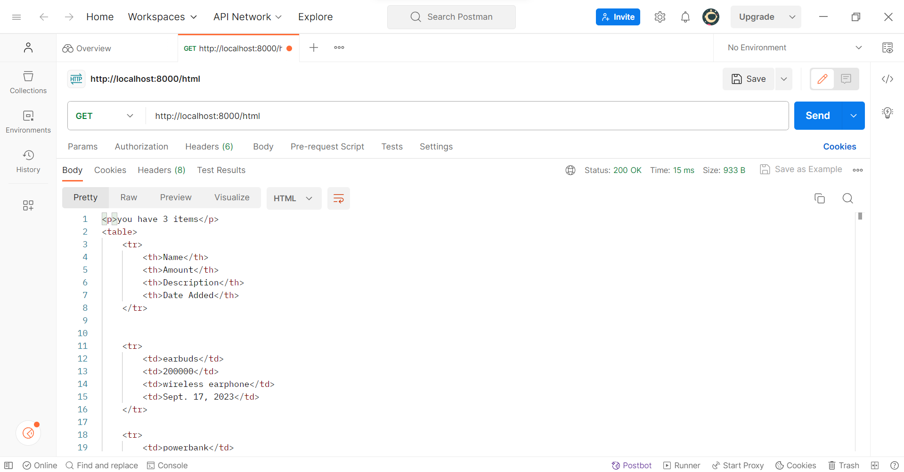
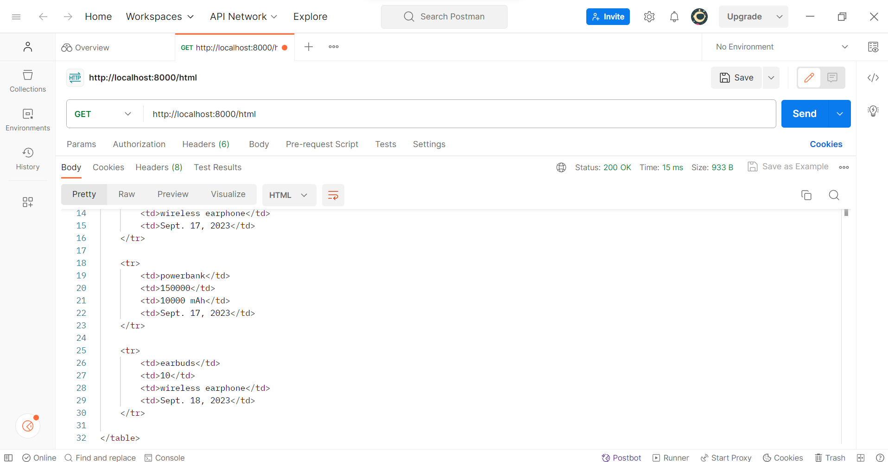
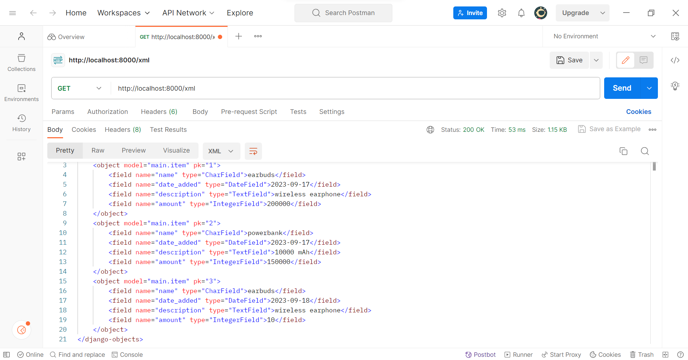
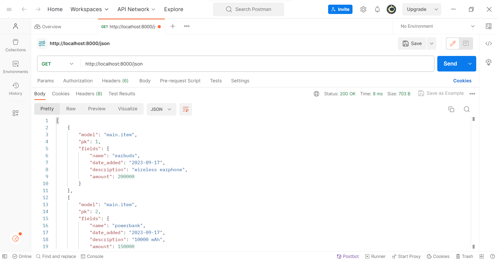
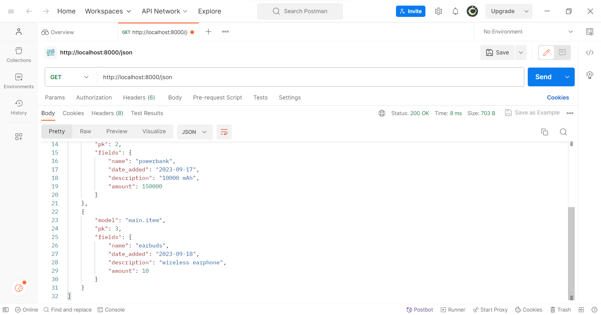
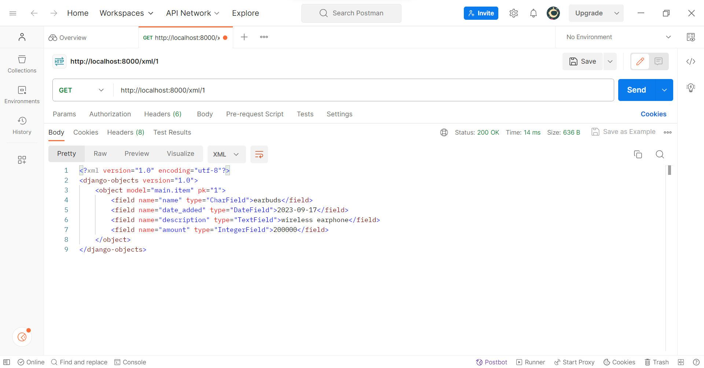
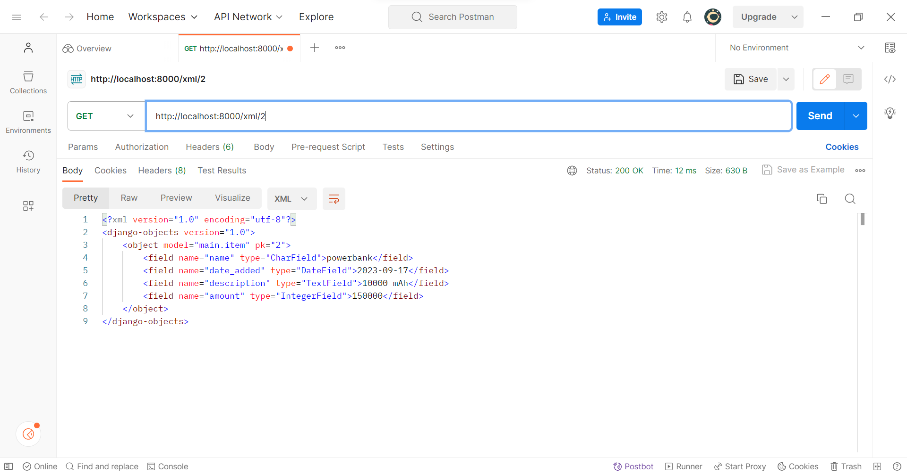
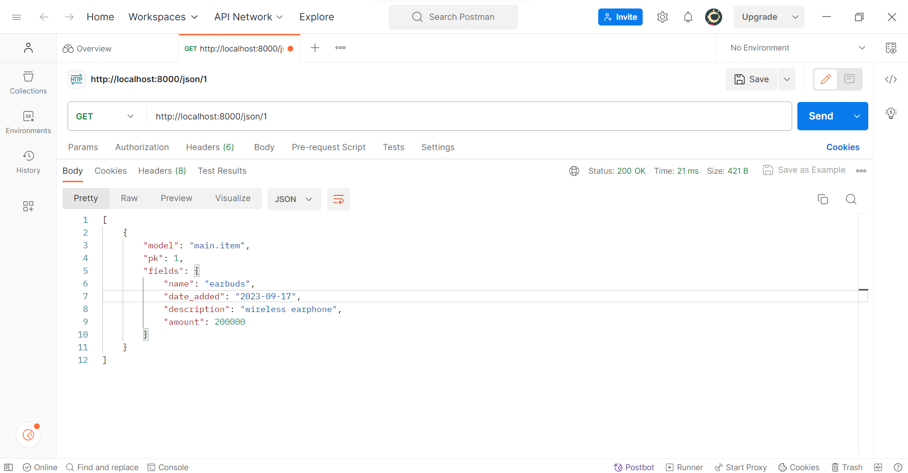
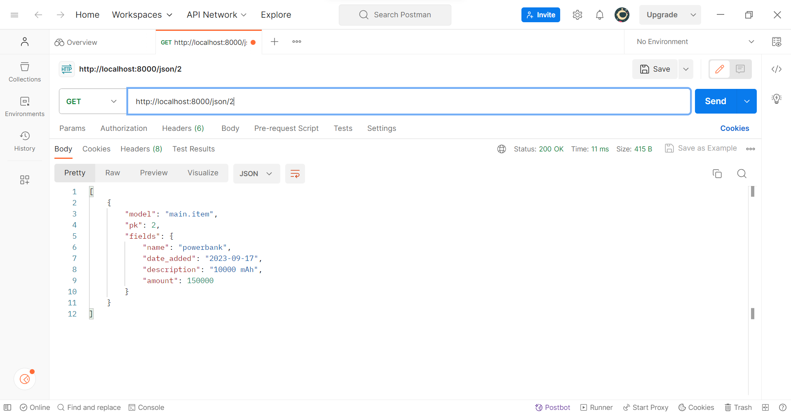

# TUGAS 2
# Penjelasan Checklist
link: https://tugas02.adaptable.app/main

#### Membuat sebuah projek django baru
* Sebelum membuat projek Django, saya membuat repositori terlebih dahulu. Saya sudah punya akun github, maka dari itu, saya langsung membuat repositori di situs github dengan nama tugas2 dan mengatur visibilitas proyek menjadi "Public".
* Setelah itu, saya membuat direktori lokal dan menginisiasinya dengan mengetik `git init` di command prompter.
* Selanjutnya, repositori direktori lokal perlu dihubungkan dengan repositori di Github. Maka dari itu, saya menjalankan terminal atau command prompt di direktori kemudian menjalankan perintah `git branch -M main` di mana saya membuat branch utama baru dengan nama "main". Untuk menghubungkan dengan repositori di Github, saya meng-copy URL repositori saya lalu menjalankan perintah `git remote add origin https://github.com/EllishaNatasha/tugas2.git`. Perintah ini bertujuan untuk memberitahu Git agar menambahkan remote repository dengan nama "origin" ke repositori lokal.
* Selanjutnya, saya membuat virtual environment dengan menjalankan perintah `python -m venv env`. Perintah ini berfungsi untuk menghindari 'tabrakan' antara package dan dependencies dari aplikasi yang baru dibuat dengan versi lain aplikasi yang ada di komputer. Untuk mengaktifkannya, saya menjalankan perintah `env\Scripts\activate.bat`
* Lalu, saya membuat berkas requirements.txt dan menambahkan dependencies. Dependencies tersebut perlu dipasang dengan perintah `pip install -r requirements.txt` 
* Setelah melakukan proses-proses di atas, barulah saya membuat projek Django dengan menjalankan perintah "django-admin startproject tugas2"
* Kemudian, saya menambahkan berkas .gitignore agar ketika push ke github, file-file yang dipush hanya file-file yang diperlukan. 

#### Membuat aplikasi dengan nama main

* Saya menjalankan perintah `python manage.py startapp main` pada command prompt untuk membuat aplikasi baru
* Selanjutnya, aplikasi tersebut perlu didaftarkan pada proyek sehingga saya memodifikasi suatu kode yang ada di berkas settings.py terutama di variabel INSTALLED_APPS. Saya menambahkan 'main' ke dalam variabel tersebut untuk mendaftarkan aplikasi yang sudah diinstal.

#### Melakukan routing pada proyek
* Untuk menghubungkan rute URL dengan tampilan, perlu dilakukan langkah-langkah berikut
* Pertama, buka berkas urls.py dalam direktori proyek dan kemudian mengimport include dari django.urls untuk mengatur URL-URL yang terkait dengan setiap aplikasi
* Kemudian, tambahkan rute URL berikut untuk mengarahkan tampilan main dalam variabel urlpatterns
    ```
    urlpatterns = [
        ...
        path('main/', include('main.urls')),
        ...
    ]
    ```
    Path URL 'main/' akan menuju ke rute yang telah didefinisikan di berkas urls.py aplikasi main

#### Membuat model pada aplikasi main 
* Pertama, buka berkas models.py pada direktori aplikasi main kemudian isi berkas tersebut dengan kode sebagai berikut:
    ```
    from django.db import models

    class Product(models.Model):
        name = models.CharField(max_length=255)
        amount = models.IntegerField()
        description = models.TextField()
    ```
    Atribut yang digunakan adalah name, amount, dan description. Name merupakan nama item dengan tipe CharField. Amount merupakan jumlah item dengan tipe IntegerField. Sedangkan description merupakan deskripsi item dengan tipe TextField.
    
#### Membuat sebuah fungsi pada views.py
* Saya membuat direktori baru bernama templates di dalam direktori aplikasi main yang di dalamnya saya buat berkas baru bernama main.html
* Berkas main.html ini akan mengatur tampilan pada web, maka perlu diisi sebagai berikut:
    ```
    <h1>Tugas 2</h1>

    <p>Name: Ellisha Natasha</p> 
    <p>Class: PBP D</p> 
    <p>Description: Glasses</p>
    <p>Amount : 50</p>
    ```
* Setelah itu, view harus dihubungkan dengan template agar tampilan web dapat menampilkan data dari model. Pertama, saya menambahkan baris kode `from django.shortcuts import render` pada berkas views.py untuk mengimpor fungsi render dari modul django.shortcuts. Render akan digunakan untuk merender tampilan HTML.
* Kemudian, saya menambahkan fungsi show_main dengan kode sebagai berikut
    ```
    def show_main(request):
        context = {
            'name': 'Ellisha Natasha',
            'class': 'PBP D',
            'description': 'Glasses',
            'amount': '50',
        }

        return render(request, "main.html", context)
    ```
    Fungsi ini untuk mengolah permintaan dan memberikan hasil tampilan yang sesuai. Kode ini memiliki context yang berupa dictionary berisi data-data yang akan ditampilkan.
* Untuk menampilkan data yang diambil dari model, saya mengubah template main.html menjadi:
    ```
    <p>Name: {{ name }}</p> 
    <p>Class: {{ class }}</p> 
    <p>Description: {{ description }}</p>
    <p>Amount : {{ amount }}</p>
    ```
    {{ name }} dan {{ class }} berisi nilai dari variabel yang sudah dibuat pada context.
    
#### Membuat sebuah routing pada urls.py aplikasi main
* Pertama, saya membuat berkas urls.py pada direktori main. Mengapa berkas ini perlu dibuat? Hal ini karena berkas ini berfungsi untuk mengarahkan request dari user ke tampilan yang tepat. Berkas ini digunakan untuk menentukan rute URL yang terkait. 
* Kemudian, berkas urls.py yang sudah dibuat diisi dengan kode berikut. 
    ```
    from django.urls import path
    from main.views import show_main

    app_name = 'main'

    urlpatterns = [
        path('', show_main, name='show_main'),
    ]
    ```
    Penjelasan dari kode di atas, yaitu:
    - app_name = 'main' berguna untuk memberikan namespace pada grup URL untuk menghindari konflik nama URL pada aplikasi dalam proyek yang mungkin memiliki URL yang sama
    - urlpatterns merupakan list objek path yang mendefinisikan pola URL, tampilan, dan nama URL. 
    - path('', show_main, name='show_main' adalah pola URL. Pola "" artinya akan cocok dengan URL root dan ketika cocok, tampilan show_main akan dipanggil.

#### Melakukan deployment ke Adaptable
* Login ke situs adaptable lalu buat aplikasi baru dan pilih connect an existing repository.
* Kemudian, pilih all repositories pada saat proses instalasi
* Pilih repo dan branch sesuai proyek
* Pilih Python App Template
* Pilih PostgreSQL
* Saya pilih python veri 3.10  lalu masukkan perintah `python manage.py migrate && gunicorn tugas2.wsgi.` pada start command
* Kemudian, saya memasukkan nama aplikasi yaitu tugas02
* Centang bagian HTTP Listener on Port dan mulai mendeploy aplikasi


---

# Bagan Request Client Beserta Responnya


##### Penjelasan kaitan antara urls.py, views.py, dan berkas html:
- HTTP request merupakan request dari client pada web browser.
- Urls.py berfungsi untuk melakukan routing dan mencari url yang sesuai untuk ditampilkan
- views.py menggunakan data yang didapat dari models.py untuk memroses request
- Jika data sudah selesai diproses dan diolah, data akan ditampilkan oleh view menggunakan tampilan dari template yang berupa berkas html
- Kemudian, hasilnya akan ditampilkan sebagai HTTP response kepada pengguna dan ditampilkan pada web user.

---

# Mengapa Kita Menggunakan Virtual Environment?
* Kita perlu menggunakan virtual environment untuk mengisolasi proyek yang kita buat. Virtual environment berfungsi untuk menghindari konflik dari paket dan dependencies dari proyek yang berbeda. Dengan membuat virtual environment, keamanan proyek dapat lebih terjaga.
* Kita tetap dapat membuat aplikasi web berbasis Django tanpa menggunakan virtual environment namun tidak dianjurkan. Hal ini karena kemungkinan terjadinya konflik lebih tinggi.


---

# Apa Itu MVC, MVT, MVVM dan Perbedannya
* MVC
Konsep MVC terdiri dari tiga komponen, yaitu Model, View, dan Controller. 
-Model merupakan data terkait penggunaan logika bekerja. 
-View merupakan interface pada aplikasi atau tampilan
-Controller menggunakan komponen Model dan berinteraksi dengan View untuk membuat hasil akhir
* MVT
Konsep MVT terdiri dari tiga komponen, yaitu Model, View, dan Template.
-Model melakukan manajemen database yang digunakan
-View bertugas mengolah perintah dan logika yang menggunakan data dari model. View juga mengatur template untuk menampilkan hasil
-Template berfungsi menangani tampilan atau interface bagi pengguna
* MVVM 
Konsep MVVM terdiri dari tiga komponen, yaitu Model, View, dan ViewModel.
-Model memiliki kode untuk pengoperasian logika serta menghubungkan request dari ViewModel ke sumber data lokal sekaligus remote
-View merupakan tampilan yang terhubung dengan user.
-ViewModel merupakan komponen yang memroses user interface.


---


---
# TUGAS 3
# Perbedaan Antara Form Post dan Form Get
* Form post mengirimkan nilai atau data ke action untuk ditampung tanpa menampilkannya di URL sehingga data-data yang ditampung akan lebih aman. Data yang dikirim tidak terbatas.
* Form get mengambil dan menampilkan nilai atau data pada URL sehingga user dapat dengan mudah menambahkan data baru. Lalu, data tersebut dikirim ke action untuk kemudian ditampung. Data pada method get tidak boleh lebih dari 2047 karakter.


---

# Perbedaan Utama Antara XML, JSON, dan HTML
* XML menyimpan data dalam struktur tree dan menggunakan sintaksis berupa tag. Biasanya XML digunakan untuk pertukaran data antar aplikasi yang berbeda.
* JSON menyajikan datanya dengan menggunakan pasangan key-value pada strukturnya. JSON menggunakan format dan sintaksis yang mudah dibaca oleh manusia. Biasanya digunakan untuk pertukaran data antara server dan klien web
* HTML merupakan bahasa markup yang digunakan untuk menentukan tampilan web. HTML menggunakan tag dengan definisi tertentu. Biasanya digunakan untuk menampilkan data dan mudah dibaca manusia.


---
# Mengapa JSON Sering Digunakan dalam Pertukaran Data Antara Aplikasi Web Modern?
Hal ini karena JSON menggunakan format pertukaran data yang ringan serta mudah dibaca dan dipahami oleh manusia. Sintaksnya juga lebih ringan dan ukurannya kecil. Metode key-value yang ada pada JSON juga efisien dan sangat kompatibel dengan berbagai bahasa pemrograman sehingga memungkinkan pengembang untuk bekerja pada struktur data dengan lancar. JSON efisien dalam melakukan transmisi data melalui jaringan dan jejak datanya lebih kecil jika dibandingkan dengan XML. Tak hanya itu, kemampuannya dalam melakukan pembaruan aplikasi tanpa hambatan memungkinkan pengembang untuk memperbarui model data maupun logika dengan mudah dan cepat.


---

# Implementasi Checklist
#### Membuat input form untuk menambahkan objek model pada app sebelumnya
* Pertama, kita perlu membuat skeleton sebagai kerangka views dari situs web kita. Saya membuat folder bernama templates pada root folder yang berisi berkas HTML bernama base.html di mana berkas ini merupakan template dasar sebagai kerangka umum untuk halaman web lainnya.
* Isi berkas tersebut dengan kode
    ```
    
    <!DOCTYPE html>
    <html lang="en">
        <head>
            <meta charset="UTF-8" />
            <meta
                name="viewport"
                content="width=device-width, initial-scale=1.0"
            />
            
            
        </head>

        <body>
            
            
        </body>
    </html>
    ```
* Kemudian, kita perlu membuat agar berkas base.html terdeteksi sebagai berkas template. Caranya adalah dengan membuka settings.py kemudian ubah menjadi potongan kode berikut:
    ```
    ...
    TEMPLATES = [
        {
            'BACKEND': 'django.template.backends.django.DjangoTemplates',
            'DIRS': [BASE_DIR / 'templates'], # Tambahkan kode ini
            'APP_DIRS': True,
            ...
        }
    ]
    ...
    ```
* Selanjutnya, kita perlu menggunakan base.html sebagai template utama, maka pada subdirektori templates yang ada di direktori main, ubah kode berkas main.html menjadi kode berikut:
    ```
    

    
        <h1>Tugas 3</h1>

        <h5>Name:</h5>
        <p>{{name}}</p>

        <h5>Class:</h5>
        <p>{{class}}</p>
    
    ```
* Untuk membuat form input data, saya membuat berkas baru pada direktori main dengan nama forms.py dan menambahkan kode berikut agar dapat menerima data produk baru.
    ```
    from django.forms import ModelForm
    from main.models import Item

    class ProductForm(ModelForm):
        class Meta:
            model = Item
            fields = ["name", "amount", "description"]
    ```
    Kode model = Item bertujuan agar ketika data dari form disimpan, isinya akan disimpan sebagai objek Item
* Selanjutnya, tambahkan import pada berkas views.py yang ada di folder main. 
    ```
    from django.http import HttpResponseRedirect
    from main.forms import ProductForm
    from django.urls import reverse
    ```
* Kemudian, saya buat fungsi baru bernama create_product yang menerima parameter request dan berisi potongan kode berikut
    ```
    def create_product(request):
        form = ProductForm(request.POST or None)

        if form.is_valid() and request.method == "POST":
            form.save()
            return HttpResponseRedirect(reverse('main:show_main'))

        context = {'form': form}
        return render(request, "create_product.html", context)
    ```
    Kode tersebut ditambahkan untuk menghasilkan form yang dapat menambahkan data secara otomatis ketika di-submit.
* Kemudian, ubah fungsi show_main pada berkas views.py menjadi:
    ```
    def show_main(request):
        items = Item.objects.all()

        context = {
            'name': 'Ellisha Natasha', 
            'class': 'PBP D', 
            'items': items
        }

        return render(request, "main.html", context)
    ```
    Fungsi Item.objects.all() berguna untuk mengambil seluruh object Item yang tersimpan.
* Selanjutnya, buka urls.py pada folder main dan import fungsi create_product
* Untuk mengakses fungsi yang sudah diimport sebelumnya, tambahkan path url ke dalam urlpatterns yang ada pada urls.py folder main.
* Kemudian, buat berkas HTML baru dengan nama create_product.html pada direktori main/templates dan mengisi berkas tersebut dengan kode berikut.
    ```
     

    
    <h1>Add New Item</h1>

    <form method="POST">
        
        <table>
            {{ form.as_table }}
            <tr>
                <td></td>
                <td>
                    <input type="submit" value="Add Item"/>
                </td>
            </tr>
        </table>
    </form>

    
    ```
    Penjelasan kode di atas:
    - Kode <form method = "POST"> berfungsi untuk menandakan blok pada form dengan metode POST.
    - Kode  merupakan token untuk security. Token ini digenerate secara otomatis oleh Django.
    - Kode {{ form.as_table }} berfungsi untuk menampilkan fields pada form yang berupa table pada forms.py
    - Kode <input type ="submit" value="Add Product"/> berguna sebagai tombol submit lalu mengirimkan request ke view.
* Lalu, saya membuat berkas show_html.html pada folder templates dan menambahkan kode berikut  yang bertujuan untuk menampilkan data produk dalam bentuk table
    ```
    <p>you have {{items|length}} items</p>
    <table>
        <tr>
            <th>Name</th>
            <th>Amount</th>
            <th>Description</th>
            <th>Date Added</th>
        </tr>


        
            <tr>
                <td>{{item.name}}</td>
                <td>{{item.amount}}</td>
                <td>{{item.description}}</td>
                <td>{{item.date_added}}</td>
            </tr>
        
    </table>
    ```
* Terakhir, saya menambahkan kode berikut pada berkas main.html untuk menambahkan button.
    ```
    <br />

        <a href="">
            <button>
                Add New Item
            </button>
        </a>
    ```

#### Tambahkan 5 fungsi views untuk melihat objek yang sudah ditambahkan dalam format HTML, XML, JSON, XML by ID, dan JSON by ID.
* HTML
    - Sebelumnya, kita perlu mengimport HttpResponse dan Serializer terlebih dahulu pada berkas views.py
        ```
        from django.http import HttpResponse
        from django.core import serializers
        ```
    - Kemudian, buat fungsi yang menerima parameter request serta tambahkan return function berupa Render.
        ```
        def show_html(request):
            data = Item.objects.all()
            return render(request, 'show_html.html', {"items" : data})
        ```
* XML
    - Pada berkas views.py yang ada di folder main, saya membuat fungsi yang menerima parameter request dengan return function berupa HTTPResponse yang sudah diserialisasi menjadi XML dan parameter yaitu content_type="application/xml".
        ```
        def show_xml(request):
            data = Item.objects.all()
            return HttpResponse(serializers.serialize("xml", data), content_type="application/xml")
        ```
        Serializer berguna untuk mentranslasikan objek model menjadi format lain.
* JSON
    - Pada berkas views.py yang ada di folder main, saya membuat fungsi yang menerima parameter request dengan return function berupa HTTPResponse yang sudah diserialisasi menjadi JSON dan parameter yaitu content_type="application/json".
        ```
        def show_json(request):
            data = Item.objects.all()
            return HttpResponse(serializers.serialize("json", data), content_type="application/json")
        ```
* XML by ID
    - Pada berkas views.py yang ada di folder main, saya membuat fungsi yang menerima parameter request dan id dengan return function berupa HTTPResponse yang sudah diserialisasi menjadi XML dan parameter yaitu content_type="application/xml".
    - Pada fungsi tersebut, saya menambahkan variabel bernama data yang menyimpan hasil query dengan id tertentu.
        ```
        def show_xml_by_id(request, id):
            data = Item.objects.filter(pk=id)
            return HttpResponse(serializers.serialize("xml", data), content_type="application/xml")
        ```
* JSON by ID
    - Pada berkas views.py yang ada di folder main, saya membuat fungsi yang menerima parameter request dan id dengan return function berupa HTTPResponse yang sudah diserialisasi menjadi JSON dan parameter yaitu content_type="application/json".
    - Pada fungsi tersebut, saya menambahkan variabel bernama data yang menyimpan hasil query dengan id tertentu.
        ```
        def show_json_by_id(request, id):
            data = Item.objects.filter(pk=id)
            return HttpResponse(serializers.serialize("json", data), content_type="application/json")
        ```

#### Membuat routing URL untuk masing-masing views yang telah ditambahkan.
* HTML
    - Pertama, saya mengimpor fungsi show_html pada berkas urls.py yang ada di folder main
    - Kemudian, saya menambahkan path url ke dalam urlpatterns.
        ```
        path('html/', show_html, name= 'show_html'),
        ```
* XML
    -  Pertama, saya mengimpor fungsi show_xml pada berkas urls.py yang ada di folder main
    - Kemudian, saya menambahkan path url ke dalam urlpatterns.
        ```
        path('xml/', show_xml, name='show_xml'), 
        ```
* JSON
    - Pertama, saya mengimpor fungsi show_json pada berkas urls.py yang ada di folder main
    - Kemudian, saya menambahkan path url ke dalam urlpatterns.
        ```
        path('json/', show_json, name='show_json'), 
        ```
* XML by ID
    - Pertama, saya mengimpor fungsi show_xml_by_id pada berkas urls.py yang ada di folder main
    - Kemudian, saya menambahkan path url ke dalam urlpatterns.
        ```
        path('xml/<int:id>/', show_xml_by_id, name='show_xml_by_id'),
        ```
* JSON by ID
    - Pertama, saya mengimpor fungsi show_json_by_id pada berkas urls.py yang ada di folder main
    - Kemudian, saya menambahkan path url ke dalam urlpatterns.
        ```
        path('json/<int:id>/', show_json_by_id, name='show_json_by_id'),
        ```


---

# Screenshot Hasil Mengakses Kelima URL Menggunakan Postman 
#### HTML



#### XML



#### JSON


    
#### XML by ID



    
#### JSON by ID




---
# TUGAS 4
# Apa itu Django UserCreationForm beserta kelebihan dan kekurangannya?
UserCreationForm adalah form yang disediakan oleh Django untuk memudahkan pengembang membuat formulir pendaftaran pengguna atau user registration form. Untuk menggunakannya, kita hanya perlu mengimport modul tersebut.
* Kelebihan dari Django UserCreationForm adalah mudah digunakan karena melakukan proses validasi yang otomatis. Hal ini memudahkan pengembang untuk mengintegrasikannya ke dalam proyek dengan cepat.
* Kekurangan dari Django UserCreationForm adalah terdapat pada kustomisasinya karena penyediaan akses kustomisasi mungkin kurang memenuhi kebutuhan pengembang. Tampilan bawaan juga terbatas sehingga pengembang perlu membuat file HTML sendiri.
    


---

# Perbedaan Autentikasi dan Otorisasi
* Autentikasi merupakan sistem yang digunakan untuk memfilter siapa saja yang berhak masuk dengan password, biometrik, dan sebagainya.
* Otorisasi adalah sistem yang merupakan batasan seseorang dapat mengakses suatu informasi. Proses ini terjadi setelah pengguna sudah diautentikasi.
Keduanya penting karena data-data dan informasi perlu dijaga keamanannya. Dengan proses autentikasi dan otorisasi, proses verifikasi pengguna dan hak akses akan dilakukan dan divalidasi terlebih dahulu untuk mengakses data sehingga keamanan akan lebih terjaga.


---

# Apa itu cookies dan bagaimana digunakan untuk mengelola data sesi pengguna?
Cookies adalah data kecil yang disimpan ketika pengguna membuka suatu web. Biasanya, cookies digunakan untuk menyimpan informasi atau aktivitas yang dilakukan pengguna seperti informasi login, pengaturan website, dan sebagainya. Cookie berisi ID sesi unik dan menyimpan data sesi pengguna. Data sesi pengguna berupa informasi-informasi yang disimpan selama sesi pengguna. Setelah itu, Django akan mengirim cookie ke perangkat pengguna dan akan disimpan. Setiap kali pengguna membuat HTTP request, cookie akan disertakan.
    


---

# Apakah penggunaan cookies aman secara default dalam pengembangan web, atau apakah ada risiko potensial yang harus diwaspadai?
Umumnya, penggunaan cookie pada website tidak berbahaya. Namun, risiko potensial tetap ada dan perlu diwaspadai, seperti kemungkinan diretas untuk kemudian digunakan agar mendapat akses ke data pengguna. 


---

# Penjelasan Checklist
#### Mengimplementasikan fungsi registrasi, login, dan logout untuk memungkinkan pengguna untuk mengakses aplikasi sebelumnya dengan lancar.
* Registrasi
    - Pertama, saya mengimpor redirect, UserCreationForm, dan messages. UserCreationForm merupakan formulir bawaan yang dapat memudahkan pembuatan formulir pendaftaran pengguna atau user registration form.
    - Kemudian, saya membuat fungsi register di views.py pada subdirektori main dan menerima parameter request. 
    - Lalu, saya membuat berkas HTML dengan nama register.html dan mengisinya dengan template untuk menampilkan form registrasi.
    - Kemudian, fungsi register ini saya impor pada urls.py dan menambahkan path url ke dalam urlpatterns.
* Login
    - Pertama, saya mengimport authenticate dan login pada views.py di subdirektori main. Authenticate, login digunakan untuk melakukan autentikasi dan login jika autentikasi berhasil.
    - Kemudian, saya membuat fungsi login_user dengan kode sebagai berikut.
        ```
        def login_user(request):
            if request.method == 'POST':
                username = request.POST.get('username')
                password = request.POST.get('password')
                user = authenticate(request, username=username, password=password)
                if user is not None:
                    login(request, user)
                    return redirect('main:show_main')
                else:
                    messages.info(request, 'Sorry, incorrect username or password. Please try again.')
            context = {}
            return render(request, 'login.html', context)
        ```
    - Lalu, saya membuat berkas HTML baru dengan nama login.html dan mengisi berkas tersebut untuk menampilkan halaman login.
    - Terakhir, saya mengimpor fungsi login_user pada urls.pu dan menambahkan path url ke urlpatterns.
* Logout
    - Pertama, saya mengimpor logout pada views.py
    - Kemudian, saya membuat fungsi bernama logout_user yang berisi kode berikut.
        ```
        def logout_user(request):
            logout(request)
            return redirect('main:login')
        ```
    - Kemudian, saya menambahkan potongan kode berikut pada berkas main.html
        ```
        <a href="">
            <button>
                Logout
            </button>
        </a>
        ```
    - Terakhir, saya mengimpor fungsi logout_user yang sudah saya buat tadi pada urls.py dan menambahkan path url ke dalam urlpatterns.

Untuk meretriksi pengguna yang dapat masuk, saya mengimpor login_required pada view.py yang digunakna untuk mewajibkan pengguna masuk atau login terlebih dahulu untuk dapat mengakses halaman web. Lalu, saya menambahkan kode @login_required(login_url='/login') sebelum fungsi show_main agar halaman main hanya dapat diakses oleh pengguna yang sudah login.
    
#### Membuat dua akun pengguna dengan masing-masing tiga dummy data menggunakan model yang telah dibuat pada aplikasi sebelumnya untuk setiap akun di lokal.
Untuk melakukan hal ini, pertama saya menjalankan python manage.py runserver lalu membuka localhost. Setelah itu, saya melakukan registrasi sekali lalu login dan add item sebanyak 3 kali. Kemudian, logout dan registrasi dengan akun baru lagi. Lalu, saya melakukan hal yang sama yaitu login dan menambahkan item sebanyak 3 kali.

#### Menghubungkan model Item dengan User.
* Pertama, saya mengimpor user pada models.py dan menambahkan potongan kode ini pada class item.
    ```
    user = models.ForeignKey(User, on_delete=models.CASCADE)
    ```
* Kemudian pada views.py ubah kode pada fungsi create_product menjadi
```
if form.is_valid() and request.method == "POST":
     item = form.save(commit=False)
     item.user = request.user
     item.save()
     return HttpResponseRedirect(reverse('main:show_main'))
```
* Terakhir, simpan semua perubahan dengan melakukan migrasi model.

#### Menampilkan detail informasi pengguna yang sedang logged in seperti username dan menerapkan cookies seperti last login pada halaman utama aplikasi.

* Untuk menampilkan username, saya mengubah kode pada fungsi show_main khususnya pada context menjadi 'name': request.user.username,
* Untuk menampilkan last logged in, saya mengimpor datetime, HttpResponseRedirect, dan reverse pada views.py kemudian mengubah fungsi login_user menjadi:
    ```
    if user is not None:
        login(request, user)
        response = HttpResponseRedirect(reverse("main:show_main")) 
        response.set_cookie('last_login', str(datetime.datetime.now()))
        return response
    ```
* Selanjutnya pada show_main saya menambahkan potongan kode berikut pada context yang berfungsi untuk menambahkan informasi cookie last_login.
```
'last_login': request.COOKIES['last_login'],
```
* Selanjutnya, saya mengubah fungsi logout_user menjadi seperti berikut
    ```
    def logout_user(request):
        logout(request)
        response = HttpResponseRedirect(reverse('main:login'))
        response.delete_cookie('last_login')
        return response
    ```
    response.delete_cookie('last_login') berfungsi untuk menghapus cookie saat pengguna logout
* Terakhir, saya menambahkan kode berikut pada berkas main.html
    ```
    <h5>Sesi terakhir login: {{ last_login }}</h5>
    ```

---

# TUGAS 5
# Jelaskan manfaat dari setiap element selector dan kapan waktu yang tepat untuk menggunakannya
Element selector berfungsi untuk mengubah properti untuk semua elemen yang memiliki tag HTML yang sama. Digunakan ketika ingin mengubah style suatu elemen seperti color, size, jenis font, dan sebagainya. 


---

    
# Jelaskan HTML5 Tag yang Kamu Ketahui
* `<!DOCTYPE>` : mendefinisikan jenis dokumen dan versi HTML
* `<a>` : mendefinisikan hyperlink
* `<body>` : tubuh dokumen
* `<button>` : mendefinisikan tombol untuk diklik
* `<div>` : mendefinisikan bagian dalam dokumen
* `` : mendefinisikan gambar
* `<p>` : mendefinisikan paragraf
* `<header>` : mendefinisikan header
* `<h1>` : judul HTML


---

# Jelaskan Perbedaan Antara Margin dan Padding
Margin digunakan untuk mengatur jarak antara elemen dengan elemen lainnya atau dengan tepi browser. Sedangkan padding digunakan untuk mengatur jarak atau menambahkan ruang kosong di sekitar elemen HTML. Jadi, penggunaan margin akan mempengaruhi tata letak keseluruhan website. Sementara itu, penggunaan padding hanya akan mempengaruhi elemen yang diberlakukan padding itu sendiri.


---

# Jelaskan Perbedaan Antara Framework CSS Tailwind dan Bootstrap. Kapan sebaiknya kita menggunakan Bootstrap daripada Tailwind, dan sebaliknya?
Tailwind merupakan framework yang memiliki fleksibilitas tinggi kepada pengembang untuk merancang tampilan, sedangkan bootstrap lebih kaku dan desainnya lebih terstruktur. Penggunaan bootstrap lebih cocok daripada tailwind ketika pengembang ingin membangun proyek dengan waktu yang sikat. Sedangkan, penggunaan tailwind akan lebih baik jika pengembangan membutuhkan tingkat kustomisasi yang tinggi.
    

---
# Jelaskan bagaimana cara kamu mengimplementasikan checklist di atas secara step-by-step.
#### Kustomisasi halaman login, register, dan tambah inventori semenarik mungkin.
* Pertama, saya menambahkan kode berikut pada base.html
    ```
    <link rel="stylesheet" href="https://maxcdn.bootstrapcdn.com/bootstrap/4.5.2/css/bootstrap.min.css">
            <script src="https://ajax.googleapis.com/ajax/libs/jquery/3.5.1/jquery.min.js"></script>
            <script src="https://cdnjs.cloudflare.com/ajax/libs/popper.js/1.16.0/umd/popper.min.js"></script>
            <script src="https://maxcdn.bootstrapcdn.com/bootstrap/4.5.2/js/bootstrap.min.js"></script>
    ```
* Selanjutnya, saya mulai mendesain tampilan website menggunakan style dan mengubah color, bentuk container pada bootstrap dan kemudian mengatur ukuran pada setiap container dengan menggunakan margin dan padding.
* Pada register, saya mengubah background color pada website dan mengubah tata letak tulisan
* Pada halaman add item, saya membuat dua container berwarna hijau dan pink dan kemudian saya ubah tata letaknya sesuai yang saya inginkan menggunakan margin dan padding

#### Kustomisasi halaman daftar inventori menjadi lebih berwarna maupun menggunakan approach lain seperti menggunakan Card.
* Pada daftar inventori, saya menggunakan card untuk menampilkan item-item yang sudah pernah ditambahkan.
* Pada card, saya menambahkan title untuk menampilkan nama item. serta text untuk descripti

---

# TUGAS 6
# Jelaskan perbedaan antara asynchronous programming dengan synchronous programming.
Perbedaannya terletak pada cara dan urutan eksekusi program. Synchronus programming akan menunggu tugas yang saat ini selesai untuk kemudian lanjut ke tugas selanjutnya, sedangkan asynchronus programming langsung menjalankan tugas secara independen tanpa harus menunggu tugas yang lain selesai. Hal ini karena asynchronus programming tidak terikat pada input output (I/O) protocol dan lebih independen daripada synchronus. Hal ini menyebabkan waktu eksekusi pada synchronus programming lebih lama daripada asynchronus programming.


---

    
# Jelaskan maksud dari paradigma event-driven programming dan sebutkan salah satu contoh penerapannya pada tugas ini.
* Paradigma event-driven programming adalah pendekatan pada programming yang merespons suatu event atau kejadian, seperti input user, sinyal, botton-click, dan sebagainya. Jadi, alur pengerjaannya tergantung dari kejadian atau event tertentu.
* Salah satu contoh penerapannya pada tugas kali ini, yaitu tombol button add item. Ketika user meng-klik button tersebut, program yang dihubungkan dengan button tersebut akan dieksekusi.


---

# Jelaskan penerapan asynchronous programming pada AJAX.
AJAX adalah Asynchronus Javascript and XML di mana penerapan ini memungkinkan aplikasi web bekerja secara asynchronus. Dalam pemrograman AJAX, pengguna melakukan permintaan ke server dan permintaan tersebut akan ditampung terlebih dahulu di mesin AJAX. Kemudian, proses akan dilakukan dengan metode asynchronus. Penerapan ini akan memungkinkan aplikasi web menjadi lebih responsif dan lebih cepat. Penerapannya adalah dengan menggunakan fetch() atau async/await.
    
---

# Bandingkan Fetch API dengan library jQuery dan tuliskan pendapat kamu teknologi manakah yang lebih baik untuk digunakan.
Fetch API merupakan teknologi yang lebih ringan karena kerjanya untuk mengambil data dari server dan sudah mendukung ES6. JQuery memiliki fungsi bawaan untuk memudahkan pemrosesan respons dan dapat menangani perbedaan antar browser. Untuk menentukan teknologi mana yang lebih baik, perlu diperhatikan kegunaan dan tujuan dari program yang dibuat. Namun, dilihat dari keringanan dan kemodernannya, fetch API lebih baik digunakan karena memiliki kelebihan yang lebih banyak.


---

# Jelaskan bagaimana cara kamu mengimplementasikan checklist di atas secara step-by-step
#### Ubahlah kode cards data item agar dapat mendukung AJAX GET.
Pada tugas sebelumnya, saya sudah mengubah data item menjadi bentuk cards dengan cara menentukan style dan ukuran cards terlebih dahulu. Setelah itu, saya melakukan looping untuk membuat cards sekaligus menambahkan data-data yang diperlukan. Kodenya adalah seperti berikut:
```

        <div class="col-md-4 mb-3">
            <div class="card bg-warning" style="border-radius: 10px;">
                <div class="card-body">
                    <h5 class="card-title">{{ item.name }}</h5>
                    <h6 class="card-subtitle mb-2 text-muted">Amount: {{ item.amount }}</h6>
                    <p class="card-text">{{ item.description }}</p>
                    <p class="card-text">Date Added: {{ item.date_added }}</p>
                </div>
            </div>
        </div>
        
```

#### Lakukan pengambilan task menggunakan AJAX GET.
* Pertama, saya membuat fungsi baru pada views.py bernama get_item_json yang menerima parameter request dan akan mereturn httpresponse 
* Selanjutnya, fungsi tersebut saya tambahkan routing dengan cara mengimpor fungsi tersebut pada berkas urls.py dan menambahkan path url tersebut ke urlpatterns 
    ```
    path('get-item/', get_item_json, name='get_item_json'),
    ```
* Langkah selanjutnya adalah memodifikasi file show_html.html. Pada blok kode pembuatan cards yang telah saya buat di tugas sebelumnya, saya menambahkan kode ini dan mengosongkan isi dari div tersebut (sebelumnya blok kode untuk membuat cards):
    ```
        <div id="item_cards" class="row"> </div>
    ```
* Selanjutnya, saya membuat blok scripts dan membuat fungsi baru bernama getItems() yang akan menggunakan fetch() API ke data JSON secara asynchronus.
    ```
    async function getItems() {
            return fetch("").then((res) => res.json())
        }
    ```
* Kemudian, saya membuat fungsi lagi dengan nama refreshItems() agar dapat me-refresh data secara asynchronus. Pada fungsi ini saya memindahkan blok kode card yang tadinya saya hapus menjadi kode seperti ini:
    ```
    async function refreshItems() {
            document.getElementById("item_cards").innerHTML = ""
            const items = await getItems()
            let htmlString = ""
            htmlString+=`\n<p class="title" style="font-size: x-large; font-weight: bold;margin-bottom: 30px;">You have ${items.length} items</p>`

            items.forEach((item) => {
            htmlString += `\n <div class="col-md-4 mb-3">
            <div class="card bg-warning" style="border-radius: 10px;">
                <div class="card-body">
                    <div class="r1 " style="display: flex; justify-content: space-between; align-items: center;margin-bottom:10px;">
                        <h1 class="card-title" style="font-size:30px;" >${item.fields.name}</h1>
                        <button class="btn btn-danger" onClick="deleteItem(${item.pk})">Delete</button>
                    </div>
                    <h6 class="card-subtitle mb-2 text-muted">${item.fields.amount}</h6>
                    <p class="card-text">${item.fields.description}</p>
                    <p class="card-text">${item.fields.date_added}</p>

            </div>
            </div>
            </div>`

            })

            document.getElementById("item_cards").innerHTML = htmlString
        }
    ```
    
#### Buatlah sebuah tombol yang membuka sebuah modal dengan form untuk menambahkan item.
* Pertama, saya menambahkan kode untuk mengimplementasikan modal bootstrap
* Selanjutnya, saya membuat button untuk menampilkan modal tersebut.
    ```
    <button type="button" class="btn btn-primary" data-bs-toggle="modal" data-bs-target="#exampleModal">Add Item</button>
    ```

#### Buatlah fungsi view baru untuk menambahkan item baru ke dalam basis data.
* Pertama, saya membuat function addItem() pada block Script
    ```
    function addItem() {
            fetch("", {
                method: "POST",
                body: new FormData(document.querySelector('#form'))
            }).then(refreshItems)

            document.getElementById("form").reset()
            return false
        }
    ```
* Kemudian, saya menambahkan kode berikut di bawah function yang sudah saya buat
    ```
    document.getElementById("button_add").onclick = addItem

    ```

#### Buatlah path /create-ajax/ yang mengarah ke fungsi view yang baru kamu buat.
Untuk langkah ini, saya menambahkan kode berikut pada urls.py di urlpatterns:
```
path('create-item-ajax/', add_item_ajax, name='add_item_ajax'),
```

#### Hubungkan form yang telah kamu buat di dalam modal kamu ke path /create-ajax/
Langkah ini sudah dilakukan ketika saya membuat function addItem dan menambahkan pathnya. 
```
path('create-item-ajax/', add_item_ajax, name='add_item_ajax'),
```
  
#### Melakukan perintah collectstatic
menjalankan perintah `python manage.py collectstatic`