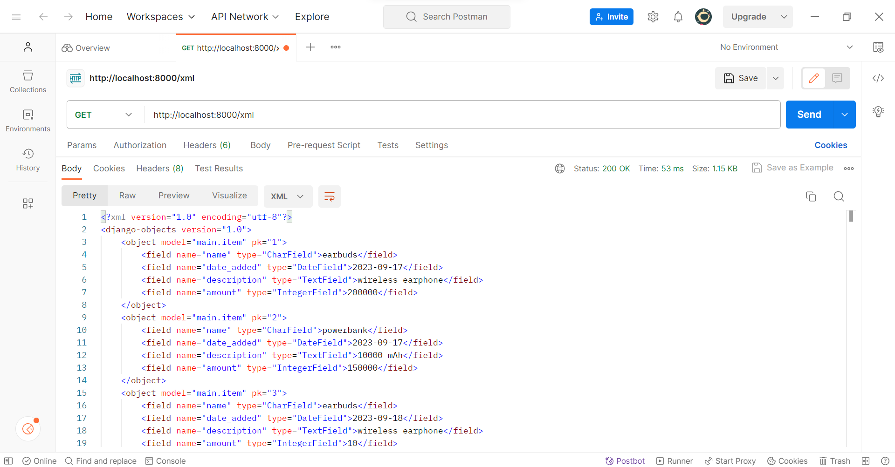
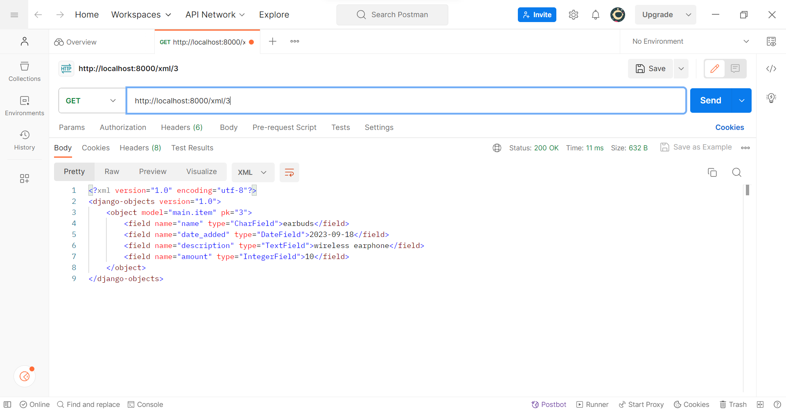

# Penjelasan Checklist
link: https://tugas02.adaptable.app/main

#### Membuat sebuah projek django baru
* Sebelum membuat projek Django, saya membuat repositori terlebih dahulu. Saya sudah punya akun github, maka dari itu, saya langsung membuat repositori di situs github dengan nama tugas2 dan mengatur visibilitas proyek menjadi "Public".
* Setelah itu, saya membuat direktori lokal dan menginisiasinya dengan mengetik `git init` di command prompter.
* Selanjutnya, repositori direktori lokal perlu dihubungkan dengan repositori di Github. Maka dari itu, saya menjalankan terminal atau command prompt di direktori kemudian menjalankan perintah `git branch -M main` di mana saya membuat branch utama baru dengan nama "main". Untuk menghubungkan dengan repositori di Github, saya meng-copy URL repositori saya lalu menjalankan perintah `git remote add origin https://github.com/EllishaNatasha/tugas2.git`. Perintah ini bertujuan untuk memberitahu Git agar menambahkan remote repository dengan nama "origin" ke repositori lokal.
* Selanjutnya, saya membuat virtual environment dengan menjalankan perintah `python -m venv env`. Perintah ini berfungsi untuk menghindari 'tabrakan' antara package dan dependencies dari aplikasi yang baru dibuat dengan versi lain aplikasi yang ada di komputer. Untuk mengaktifkannya, saya menjalankan perintah `env\Scripts\activate.bat`
* Lalu, saya membuat berkas requirements.txt dan menambahkan dependencies. Dependencies tersebut perlu dipasang dengan perintah `pip install -r requirements.txt` 
* Setelah melakukan proses-proses di atas, barulah saya membuat projek Django dengan menjalankan perintah "django-admin startproject tugas2"
* Kemudian, saya menambahkan berkas .gitignore agar ketika push ke github, file-file yang dipush hanya file-file yang diperlukan. 

#### Membuat aplikasi dengan nama main

* Saya menjalankan perintah `python manage.py startapp main` pada command prompt untuk membuat aplikasi baru
* Selanjutnya, aplikasi tersebut perlu didaftarkan pada proyek sehingga saya memodifikasi suatu kode yang ada di berkas settings.py terutama di variabel INSTALLED_APPS. Saya menambahkan 'main' ke dalam variabel tersebut untuk mendaftarkan aplikasi yang sudah diinstal.

#### Melakukan routing pada proyek
* Untuk menghubungkan rute URL dengan tampilan, perlu dilakukan langkah-langkah berikut
* Pertama, buka berkas urls.py dalam direktori proyek dan kemudian mengimport include dari django.urls untuk mengatur URL-URL yang terkait dengan setiap aplikasi
* Kemudian, tambahkan rute URL berikut untuk mengarahkan tampilan main dalam variabel urlpatterns
    ```
    urlpatterns = [
        ...
        path('main/', include('main.urls')),
        ...
    ]
    ```
    Path URL 'main/' akan menuju ke rute yang telah didefinisikan di berkas urls.py aplikasi main

#### Membuat model pada aplikasi main 
* Pertama, buka berkas models.py pada direktori aplikasi main kemudian isi berkas tersebut dengan kode sebagai berikut:
    ```
    from django.db import models

    class Product(models.Model):
        name = models.CharField(max_length=255)
        amount = models.IntegerField()
        description = models.TextField()
    ```
    Atribut yang digunakan adalah name, amount, dan description. Name merupakan nama item dengan tipe CharField. Amount merupakan jumlah item dengan tipe IntegerField. Sedangkan description merupakan deskripsi item dengan tipe TextField.
    
#### Membuat sebuah fungsi pada views.py
* Saya membuat direktori baru bernama templates di dalam direktori aplikasi main yang di dalamnya saya buat berkas baru bernama main.html
* Berkas main.html ini akan mengatur tampilan pada web, maka perlu diisi sebagai berikut:
    ```
    <h1>Tugas 2</h1>

    <p>Name: Ellisha Natasha</p> 
    <p>Class: PBP D</p> 
    <p>Description: Glasses</p>
    <p>Amount : 50</p>
    ```
* Setelah itu, view harus dihubungkan dengan template agar tampilan web dapat menampilkan data dari model. Pertama, saya menambahkan baris kode `from django.shortcuts import render` pada berkas views.py untuk mengimpor fungsi render dari modul django.shortcuts. Render akan digunakan untuk merender tampilan HTML.
* Kemudian, saya menambahkan fungsi show_main dengan kode sebagai berikut
    ```
    def show_main(request):
        context = {
            'name': 'Ellisha Natasha',
            'class': 'PBP D',
            'description': 'Glasses',
            'amount': '50',
        }

        return render(request, "main.html", context)
    ```
    Fungsi ini untuk mengolah permintaan dan memberikan hasil tampilan yang sesuai. Kode ini memiliki context yang berupa dictionary berisi data-data yang akan ditampilkan.
* Untuk menampilkan data yang diambil dari model, saya mengubah template main.html menjadi:
    ```
    <p>Name: {{ name }}</p> 
    <p>Class: {{ class }}</p> 
    <p>Description: {{ description }}</p>
    <p>Amount : {{ amount }}</p>
    ```
    {{ name }} dan {{ class }} berisi nilai dari variabel yang sudah dibuat pada context.
    
#### Membuat sebuah routing pada urls.py aplikasi main
* Pertama, saya membuat berkas urls.py pada direktori main. Mengapa berkas ini perlu dibuat? Hal ini karena berkas ini berfungsi untuk mengarahkan request dari user ke tampilan yang tepat. Berkas ini digunakan untuk menentukan rute URL yang terkait. 
* Kemudian, berkas urls.py yang sudah dibuat diisi dengan kode berikut. 
    ```
    from django.urls import path
    from main.views import show_main

    app_name = 'main'

    urlpatterns = [
        path('', show_main, name='show_main'),
    ]
    ```
    Penjelasan dari kode di atas, yaitu:
    - app_name = 'main' berguna untuk memberikan namespace pada grup URL untuk menghindari konflik nama URL pada aplikasi dalam proyek yang mungkin memiliki URL yang sama
    - urlpatterns merupakan list objek path yang mendefinisikan pola URL, tampilan, dan nama URL. 
    - path('', show_main, name='show_main' adalah pola URL. Pola "" artinya akan cocok dengan URL root dan ketika cocok, tampilan show_main akan dipanggil.

#### Melakukan deployment ke Adaptable
* Login ke situs adaptable lalu buat aplikasi baru dan pilih connect an existing repository.
* Kemudian, pilih all repositories pada saat proses instalasi
* Pilih repo dan branch sesuai proyek
* Pilih Python App Template
* Pilih PostgreSQL
* Saya pilih python veri 3.10  lalu masukkan perintah `python manage.py migrate && gunicorn tugas2.wsgi.` pada start command
* Kemudian, saya memasukkan nama aplikasi yaitu tugas02
* Centang bagian HTTP Listener on Port dan mulai mendeploy aplikasi


---

# Bagan Request Client Beserta Responnya


##### Penjelasan kaitan antara urls.py, views.py, dan berkas html:
- HTTP request merupakan request dari client pada web browser.
- Urls.py berfungsi untuk melakukan routing dan mencari url yang sesuai untuk ditampilkan
- views.py menggunakan data yang didapat dari models.py untuk memroses request
- Jika data sudah selesai diproses dan diolah, data akan ditampilkan oleh view menggunakan tampilan dari template yang berupa berkas html
- Kemudian, hasilnya akan ditampilkan sebagai HTTP response kepada pengguna dan ditampilkan pada web user.

---

# Mengapa Kita Menggunakan Virtual Environment?
* Kita perlu menggunakan virtual environment untuk mengisolasi proyek yang kita buat. Virtual environment berfungsi untuk menghindari konflik dari paket dan dependencies dari proyek yang berbeda. Dengan membuat virtual environment, keamanan proyek dapat lebih terjaga.
* Kita tetap dapat membuat aplikasi web berbasis Django tanpa menggunakan virtual environment namun tidak dianjurkan. Hal ini karena kemungkinan terjadinya konflik lebih tinggi.


---

# Apa Itu MVC, MVT, MVVM dan Perbedannya
* MVC
Konsep MVC terdiri dari tiga komponen, yaitu Model, View, dan Controller. 
-Model merupakan data terkait penggunaan logika bekerja. 
-View merupakan interface pada aplikasi atau tampilan
-Controller menggunakan komponen Model dan berinteraksi dengan View untuk membuat hasil akhir
* MVT
Konsep MVT terdiri dari tiga komponen, yaitu Model, View, dan Template.
-Model melakukan manajemen database yang digunakan
-View bertugas mengolah perintah dan logika yang menggunakan data dari model. View juga mengatur template untuk menampilkan hasil
-Template berfungsi menangani tampilan atau interface bagi pengguna
* MVVM 
Konsep MVVM terdiri dari tiga komponen, yaitu Model, View, dan ViewModel.
-Model memiliki kode untuk pengoperasian logika serta menghubungkan request dari ViewModel ke sumber data lokal sekaligus remote
-View merupakan tampilan yang terhubung dengan user.
-ViewModel merupakan komponen yang memroses user interface.


---


---
# Perbedaan Antara Form Post dan Form Get
* Form post mengirimkan nilai atau data ke action untuk ditampung tanpa menampilkannya di URL sehingga data-data yang ditampung akan lebih aman. Data yang dikirim tidak terbatas.
* Form get mengambil dan menampilkan nilai atau data pada URL sehingga user dapat dengan mudah menambahkan data baru. Lalu, data tersebut dikirim ke action untuk kemudian ditampung. Data pada method get tidak boleh lebih dari 2047 karakter.


---

# Perbedaan Utama Antara XML, JSON, dan HTML
* XML menyimpan data dalam struktur tree dan menggunakan sintaksis berupa tag. Biasanya XML digunakan untuk pertukaran data antar aplikasi yang berbeda.
* JSON menyajikan datanya dengan menggunakan pasangan key-value pada strukturnya. JSON menggunakan format dan sintaksis yang mudah dibaca oleh manusia. Biasanya digunakan untuk pertukaran data antara server dan klien web
* HTML merupakan bahasa markup yang digunakan untuk menentukan tampilan web. HTML menggunakan tag dengan definisi tertentu. Biasanya digunakan untuk menampilkan data dan mudah dibaca manusia.


---
# Mengapa JSON Sering Digunakan dalam Pertukaran Data Antara Aplikasi Web Modern?
Hal ini karena JSON menggunakan format pertukaran data yang ringan serta mudah dibaca dan dipahami oleh manusia. Sintaksnya juga lebih ringan dan ukurannya kecil. Metode key-value yang ada pada JSON juga efisien dan sangat kompatibel dengan berbagai bahasa pemrograman sehingga memungkinkan pengembang untuk bekerja pada struktur data dengan lancar. JSON efisien dalam melakukan transmisi data melalui jaringan dan jejak datanya lebih kecil jika dibandingkan dengan XML. Tak hanya itu, kemampuannya dalam melakukan pembaruan aplikasi tanpa hambatan memungkinkan pengembang untuk memperbarui model data maupun logika dengan mudah dan cepat.


---

# Implementasi Checklist
#### Membuat input form untuk menambahkan objek model pada app sebelumnya
* Pertama, kita perlu membuat skeleton sebagai kerangka views dari situs web kita. Saya membuat folder bernama templates pada root folder yang berisi berkas HTML bernama base.html di mana berkas ini merupakan template dasar sebagai kerangka umum untuk halaman web lainnya.
* Isi berkas tersebut dengan kode
    ```
    
    <!DOCTYPE html>
    <html lang="en">
        <head>
            <meta charset="UTF-8" />
            <meta
                name="viewport"
                content="width=device-width, initial-scale=1.0"
            />
            
            
        </head>

        <body>
            
            
        </body>
    </html>
    ```
* Kemudian, kita perlu membuat agar berkas base.html terdeteksi sebagai berkas template. Caranya adalah dengan membuka settings.py kemudian ubah menjadi potongan kode berikut:
    ```
    ...
    TEMPLATES = [
        {
            'BACKEND': 'django.template.backends.django.DjangoTemplates',
            'DIRS': [BASE_DIR / 'templates'], # Tambahkan kode ini
            'APP_DIRS': True,
            ...
        }
    ]
    ...
    ```
* Selanjutnya, kita perlu menggunakan base.html sebagai template utama, maka pada subdirektori templates yang ada di direktori main, ubah kode berkas main.html menjadi kode berikut:
    ```
    

    
        <h1>Tugas 3</h1>

        <h5>Name:</h5>
        <p>{{name}}</p>

        <h5>Class:</h5>
        <p>{{class}}</p>
    
    ```
* Untuk membuat form input data, saya membuat berkas baru pada direktori main dengan nama forms.py dan menambahkan kode berikut agar dapat menerima data produk baru.
    ```
    from django.forms import ModelForm
    from main.models import Item

    class ProductForm(ModelForm):
        class Meta:
            model = Item
            fields = ["name", "amount", "description"]
    ```
    Kode model = Item bertujuan agar ketika data dari form disimpan, isinya akan disimpan sebagai objek Item
* Selanjutnya, tambahkan import pada berkas views.py yang ada di folder main. 
    ```
    from django.http import HttpResponseRedirect
    from main.forms import ProductForm
    from django.urls import reverse
    ```
* Kemudian, saya buat fungsi baru bernama create_product yang menerima parameter request dan berisi potongan kode berikut
    ```
    def create_product(request):
        form = ProductForm(request.POST or None)

        if form.is_valid() and request.method == "POST":
            form.save()
            return HttpResponseRedirect(reverse('main:show_main'))

        context = {'form': form}
        return render(request, "create_product.html", context)
    ```
    Kode tersebut ditambahkan untuk menghasilkan form yang dapat menambahkan data secara otomatis ketika di-submit.
* Kemudian, ubah fungsi show_main pada berkas views.py menjadi:
    ```
    def show_main(request):
        items = Item.objects.all()

        context = {
            'name': 'Ellisha Natasha', 
            'class': 'PBP D', 
            'items': items
        }

        return render(request, "main.html", context)
    ```
    Fungsi Item.objects.all() berguna untuk mengambil seluruh object Item yang tersimpan.
* Selanjutnya, buka urls.py pada folder main dan import fungsi create_product
* Untuk mengakses fungsi yang sudah diimport sebelumnya, tambahkan path url ke dalam urlpatterns yang ada pada urls.py folder main.
* Kemudian, buat berkas HTML baru dengan nama create_product.html pada direktori main/templates dan mengisi berkas tersebut dengan kode berikut.
    ```
     

    
    <h1>Add New Item</h1>

    <form method="POST">
        
        <table>
            {{ form.as_table }}
            <tr>
                <td></td>
                <td>
                    <input type="submit" value="Add Item"/>
                </td>
            </tr>
        </table>
    </form>

    
    ```
    Penjelasan kode di atas:
    - Kode <form method = "POST"> berfungsi untuk menandakan blok pada form dengan metode POST.
    - Kode  merupakan token untuk security. Token ini digenerate secara otomatis oleh Django.
    - Kode {{ form.as_table }} berfungsi untuk menampilkan fields pada form yang berupa table pada forms.py
    - Kode <input type ="submit" value="Add Product"/> berguna sebagai tombol submit lalu mengirimkan request ke view.
* Lalu, saya membuat berkas show_html.html pada folder templates dan menambahkan kode berikut  yang bertujuan untuk menampilkan data produk dalam bentuk table
    ```
    <p>you have {{items|length}} items</p>
    <table>
        <tr>
            <th>Name</th>
            <th>Amount</th>
            <th>Description</th>
            <th>Date Added</th>
        </tr>


        
            <tr>
                <td>{{item.name}}</td>
                <td>{{item.amount}}</td>
                <td>{{item.description}}</td>
                <td>{{item.date_added}}</td>
            </tr>
        
    </table>
    ```
* Terakhir, saya menambahkan kode berikut pada berkas main.html untuk menambahkan button.
    ```
    <br />

        <a href="">
            <button>
                Add New Item
            </button>
        </a>
    ```

#### Tambahkan 5 fungsi views untuk melihat objek yang sudah ditambahkan dalam format HTML, XML, JSON, XML by ID, dan JSON by ID.
* HTML
    - Sebelumnya, kita perlu mengimport HttpResponse dan Serializer terlebih dahulu pada berkas views.py
        ```
        from django.http import HttpResponse
        from django.core import serializers
        ```
    - Kemudian, buat fungsi yang menerima parameter request serta tambahkan return function berupa Render.
        ```
        def show_html(request):
            data = Item.objects.all()
            return render(request, 'show_html.html', {"items" : data})
        ```
* XML
    - Pada berkas views.py yang ada di folder main, saya membuat fungsi yang menerima parameter request dengan return function berupa HTTPResponse yang sudah diserialisasi menjadi XML dan parameter yaitu content_type="application/xml".
        ```
        def show_xml(request):
            data = Item.objects.all()
            return HttpResponse(serializers.serialize("xml", data), content_type="application/xml")
        ```
        Serializer berguna untuk mentranslasikan objek model menjadi format lain.
* JSON
    - Pada berkas views.py yang ada di folder main, saya membuat fungsi yang menerima parameter request dengan return function berupa HTTPResponse yang sudah diserialisasi menjadi JSON dan parameter yaitu content_type="application/json".
        ```
        def show_json(request):
            data = Item.objects.all()
            return HttpResponse(serializers.serialize("json", data), content_type="application/json")
        ```
* XML by ID
    - Pada berkas views.py yang ada di folder main, saya membuat fungsi yang menerima parameter request dan id dengan return function berupa HTTPResponse yang sudah diserialisasi menjadi XML dan parameter yaitu content_type="application/xml".
    - Pada fungsi tersebut, saya menambahkan variabel bernama data yang menyimpan hasil query dengan id tertentu.
        ```
        def show_xml_by_id(request, id):
            data = Item.objects.filter(pk=id)
            return HttpResponse(serializers.serialize("xml", data), content_type="application/xml")
        ```
* JSON by ID
    - Pada berkas views.py yang ada di folder main, saya membuat fungsi yang menerima parameter request dan id dengan return function berupa HTTPResponse yang sudah diserialisasi menjadi JSON dan parameter yaitu content_type="application/json".
    - Pada fungsi tersebut, saya menambahkan variabel bernama data yang menyimpan hasil query dengan id tertentu.
        ```
        def show_json_by_id(request, id):
            data = Item.objects.filter(pk=id)
            return HttpResponse(serializers.serialize("json", data), content_type="application/json")
        ```

#### Membuat routing URL untuk masing-masing views yang telah ditambahkan.
* HTML
    - Pertama, saya mengimpor fungsi show_html pada berkas urls.py yang ada di folder main
    - Kemudian, saya menambahkan path url ke dalam urlpatterns.
        ```
        path('html/', show_html, name= 'show_html'),
        ```
* XML
    -  Pertama, saya mengimpor fungsi show_xml pada berkas urls.py yang ada di folder main
    - Kemudian, saya menambahkan path url ke dalam urlpatterns.
        ```
        path('xml/', show_xml, name='show_xml'), 
        ```
* JSON
    - Pertama, saya mengimpor fungsi show_json pada berkas urls.py yang ada di folder main
    - Kemudian, saya menambahkan path url ke dalam urlpatterns.
        ```
        path('json/', show_json, name='show_json'), 
        ```
* XML by ID
    - Pertama, saya mengimpor fungsi show_xml_by_id pada berkas urls.py yang ada di folder main
    - Kemudian, saya menambahkan path url ke dalam urlpatterns.
        ```
        path('xml/<int:id>/', show_xml_by_id, name='show_xml_by_id'),
        ```
* JSON by ID
    - Pertama, saya mengimpor fungsi show_json_by_id pada berkas urls.py yang ada di folder main
    - Kemudian, saya menambahkan path url ke dalam urlpatterns.
        ```
        path('json/<int:id>/', show_json_by_id, name='show_json_by_id'),
        ```


---

# Screenshot Hasil Mengakses Kelima URL Menggunakan Postman 
#### HTML


#### XML



#### JSON


    
#### XML by ID



    
#### JSON by ID


